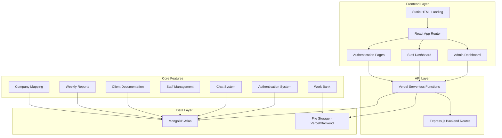
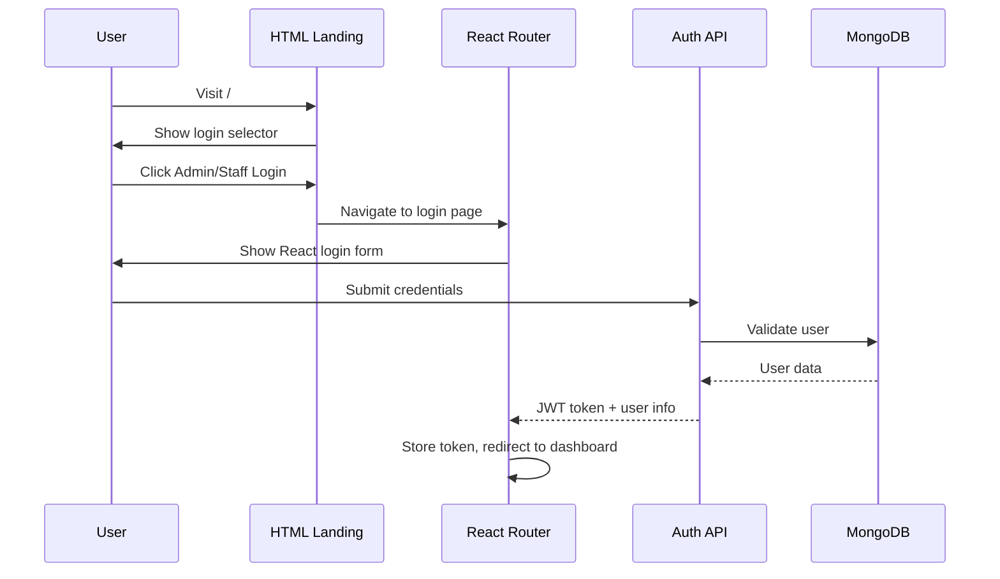
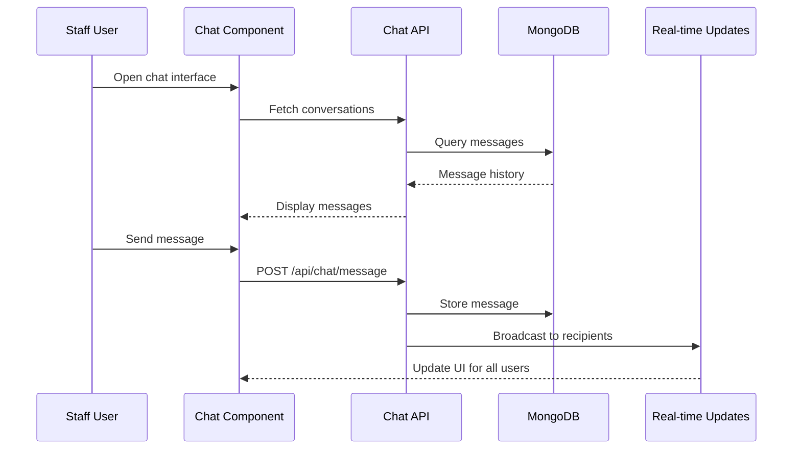

# Design Document: Company App Restoration

## Overview

The Company App Restoration project aims to rebuild the complete Company Management System functionality on top of the existing Vercel deployment foundation. The system currently has a working MongoDB connection and basic HTML interface, but needs full integration with the existing React application that contains comprehensive features including authentication, dashboards, chat system, staff management, client documentation, and reporting capabilities.

The restoration involves migrating from a standalone React development environment to a production-ready Vercel deployment while preserving all existing functionality and ensuring mobile responsiveness. The system serves as a comprehensive business management platform for Xtreme Cr8ivity, handling staff operations, client projects, internal communications, and administrative oversight.

## Architecture



## Sequence Diagrams

### User Authentication Flow



### Chat System Flow



## Components and Interfaces

### Component 1: Authentication System

**Purpose**: Handles user login, session management, and role-based access control

**Interface**:
```typescript
interface AuthService {
  login(credentials: LoginCredentials): Promise<AuthResult>
  logout(): void
  getCurrentUser(): User | null
  isAuthenticated(): boolean
  hasRole(role: UserRole): boolean
}

interface LoginCredentials {
  email: string
  password: string
  role: 'admin' | 'staff'
}

interface AuthResult {
  success: boolean
  token?: string
  user?: User
  error?: string
}
```

**Responsibilities**:
- Validate user credentials against MongoDB
- Generate and manage JWT tokens
- Maintain session state in localStorage
- Redirect users based on role permissions
- Handle authentication errors and token expiration

### Component 2: Dashboard Router

**Purpose**: Routes users to appropriate dashboards based on their role and authentication status

**Interface**:
```typescript
interface DashboardRouter {
  routeUser(user: User): string
  getDefaultRoute(role: UserRole): string
  validateAccess(route: string, user: User): boolean
}

interface User {
  id: string
  name: string
  email: string
  role: 'admin' | 'staff'
  department?: Department
  permissions: string[]
}
```

**Responsibilities**:
- Determine correct dashboard based on user role
- Enforce route-level permissions
- Handle unauthorized access attempts
- Maintain navigation state

### Component 3: Chat System

**Purpose**: Provides WhatsApp-style messaging with real-time updates, file sharing, and group conversations

**Interface**:
```typescript
interface ChatService {
  sendMessage(message: MessageData): Promise<void>
  getConversations(): Promise<Conversation[]>
  getMessages(conversationId: string): Promise<Message[]>
  uploadFile(file: File): Promise<FileUpload>
  markAsRead(messageId: string): Promise<void>
}

interface MessageData {
  text: string
  receiverId: string
  files?: File[]
  replyToId?: string
}

interface Conversation {
  id: string
  type: 'private' | 'department' | 'all'
  participants: User[]
  lastMessage?: Message
  unreadCount: number
}
```

**Responsibilities**:
- Real-time message delivery and updates
- File upload and sharing capabilities
- Message threading and replies
- Read receipts and typing indicators
- Group chat management for departm and Prettier for code quality
- TypeScript for type safety

**Infrastructure Dependencies**:
- Vercel for hosting and serverless functions
- MongoDB Atlas for database hosting
- Vercel Blob or similar for file storage
- Environment variable management for configuration

**External Services**:
- Email service (SendGrid/Nodemailer) for notifications
- Jitsi Meet for video calling features
- Optional: Redis for caching if needed for performanceForm for form management
- Material-UI or similar for consistent styling
- Socket.io-client for real-time chat features

**Backend Dependencies**:
- Express.js for API routing
- Mongoose for MongoDB integration
- bcryptjs for password hashing
- jsonwebtoken for JWT handling
- multer for file upload handling
- cors for cross-origin request handling

**Development Dependencies**:
- Jest and React Testing Library for unit testing
- Playwright for end-to-end testing
- fast-check for property-based testing
- ESLintsitive data at rest. Use HTTPS for all communications. Implement proper CORS policies for API endpoints.

**Input Validation**: Sanitize all user inputs to prevent XSS and injection attacks. Use parameterized queries for database operations.

**Session Management**: Implement secure session handling with proper timeout mechanisms. Log security events for audit purposes.

## Dependencies

**Frontend Dependencies**:
- React 18+ with React Router for navigation
- Axios or Fetch API for HTTP requests
- React Hook ment JWT token expiration and refresh mechanisms. Store sensitive tokens in httpOnly cookies where possible.

**Authorization Controls**: Implement role-based access control (RBAC) at both frontend and backend levels. Validate user permissions on every API request, not just frontend routing.

**File Upload Security**: Validate file types and sizes on both client and server. Scan uploaded files for malware. Store files outside web root and serve through controlled endpoints.

**Data Protection**: Encrypt senfor static assets and API responses where appropriate.

**Bundle Optimization**: Code splitting for React components to reduce initial bundle size. Lazy load non-critical features like chat system and file management to improve first page load.

**API Response Optimization**: Implement pagination for large data sets, compress API responses, and use efficient serialization for complex objects.

## Security Considerations

**Authentication Security**: Use bcrypt for password hashing with minimum 12 rounds. Imple indexing for frequently queried fields (user email, message timestamps, file paths). Use MongoDB aggregation pipelines for complex queries to reduce data transfer.

**File Storage Strategy**: Leverage Vercel's edge network for static file serving. Implement lazy loading for large file lists and thumbnail generation for images to reduce initial load times.

**Caching Strategy**: Implement Redis caching for frequently accessed data like user sessions, department lists, and recent messages. Use browser caching o verify complete user workflows:

- **User Journey Tests**: Complete authentication → dashboard → feature usage flows
- **Cross-Browser Testing**: Ensure compatibility across Chrome, Firefox, Safari
- **Mobile Responsiveness Tests**: Verify all features work on mobile devices
- **Performance Tests**: Validate page load times and API response times
- **File Upload Integration**: Test complete upload → storage → retrieval workflows

## Performance Considerations

**Database Query Optimization**: Implement properased Testing Approach

Using fast-check library for JavaScript to generate test cases that verify system properties:

**Property Test Library**: fast-check

**Key Properties to Test**:
- Authentication tokens are always valid when generated
- File uploads preserve data integrity across all file types
- Database operations maintain referential integrity
- User permissions are consistently enforced
- Message delivery maintains chronological order

### Integration Testing Approach

End-to-end testing using Playwright tflows, token management, role verification
- **API Integration Tests**: Verify all endpoints work correctly with Vercel serverless functions
- **Component Rendering Tests**: Ensure all React components render correctly with various props
- **File Upload Tests**: Test file validation, upload progress, error handling
- **Database Operation Tests**: Verify CRUD operations maintain data integrity

**Coverage Goals**: Minimum 80% code coverage for critical paths, 90% for authentication and data handling

### Property-Bs

### Error Scenario 5: Component Integration Failure

**Condition**: React component fails to load or integrate properly
**Response**: Display fallback UI, log integration error, prevent cascade failures
**Recovery**: Reload component, provide manual refresh option, maintain core functionality

## Testing Strategy

### Unit Testing Approach

Each component will be tested in isolation using Jest and React Testing Library. Key test categories include:

- **Authentication Service Tests**: Validate login/logout rations locally, display offline indicator, attempt automatic reconnection
**Recovery**: Restore connection automatically, sync queued operations, notify user of restored connectivity

### Error Scenario 4: API Endpoint Failure

**Condition**: Vercel serverless function fails or times out
**Response**: Display user-friendly error message, log detailed error for debugging, provide fallback options where possible
**Recovery**: Automatic retry with exponential backoff, graceful degradation of non-critical featureurity by not revealing specific failure reasons

### Error Scenario 2: File Upload Failure

**Condition**: File upload fails due to size limits, network issues, or storage problems
**Response**: Display specific error message, maintain partial upload state, allow retry of failed files
**Recovery**: User can retry upload with corrected files, system cleans up any partial uploads

### Error Scenario 3: Database Connection Loss

**Condition**: MongoDB connection is lost during operation
**Response**: Queue opee, recipient))
```

**Property 6: Session Management**
```
∀ session ∈ Sessions:
  (session.expired ∨ session.invalidated) ⟹ 
    ¬canPerformActions(session) ∧ requiresReauthentication(session.user)
```

## Error Handling

### Error Scenario 1: Authentication Failure

**Condition**: User provides invalid credentials or token expires
**Response**: Clear authentication state, redirect to login page, display appropriate error message
**Recovery**: User can retry login with correct credentials, system maintains secpleted ⟹ 
    (operation.successful ⟹ databaseState.consistent) ∧
    (¬operation.successful ⟹ databaseState = databaseState.previous)
```

**Property 4: File Upload Integrity**
```
∀ file ∈ UploadedFiles:
  stored(file) ⟹ 
    (fileExists(file.path) ∧ fileReadable(file.path) ∧ 
     databaseRecord(file) ∧ checksumValid(file))
```

**Property 5: Message Delivery Guarantee**
```
∀ message ∈ Messages, ∀ recipient ∈ Recipients:
  sent(message, recipient) ∧ recipientOnline(recipient) ⟹ 
    eventually(received(messag ∈ Users, ∀ session ∈ Sessions:
  authenticated(user, session) ⟹ 
    (hasValidToken(session) ∧ tokenBelongsTo(session.token, user) ∧ 
     userExists(user) ∧ userActive(user))
```

**Property 2: Role-Based Access Control**
```
∀ user ∈ Users, ∀ resource ∈ Resources:
  canAccess(user, resource) ⟹ 
    (authenticated(user) ∧ hasPermission(user.role, resource) ∧ 
     resourceExists(resource) ∧ resourceActive(resource))
```

**Property 3: Data Consistency**
```
∀ operation ∈ DatabaseOperations:
  operation.comeInput').files;

try {
  const results = await fileUploadService.uploadFiles(files, 'work');
  results.forEach(result => {
    if (result.success) {
      addFileToWorkBank(result.fileData);
    } else {
      showError(`Failed to upload ${result.filename}: ${result.error}`);
    }
  });
} catch (error) {
  showError('Upload process failed: ' + error.message);
}
```

## Correctness Properties

*A property is a characteristic or behavior that should hold true across all valid executions of a system-essentially, a formal statement about what the system should do. Properties serve as the bridge between human-readable specifications and machine-verifiable correctness guarantees.*

### Property 1: Authentication Token Validity

*For any* valid user credentials, successful authentication should generate a valid JWT token that correctly identifies the user and their role.

**Validates: Requirements 1.2, 1.4, 1.5**

### Property 2: Role-Based Access Control

*For any* authenticated user attempting to access system resources, access should be granted if and only if the user's role has appropriate permissions for that resource.

**Validates: Requirements 1.4, 1.5, 2.1, 2.2, 2.3**

### Property 3: Message Delivery Consistency

*For any* message sent through the chat system, it should be delivered to all intended recipients and stored with correct metadata.

**Validates: Requirements 3.1, 3.3, 3.5**

### Property 4: File Upload Integrity

*For any* file uploaded to the system, if the upload succeeds, the file should be stored securely, be retrievable, and maintain data integrity.

**Validates: Requirements 3.2, 3.6, 6.1, 8.1, 8.2, 8.5**

### Property 5: Staff Management Data Consistency

*For any* staff management operation (create, update, delete), the operation should maintain referential integrity across all related system components.

**Validates: Requirements 4.1, 4.2, 4.3, 4.6**

### Property 6: Session State Persistence

*For any* authenticated user navigating between system features, their authentication state and user context should be maintained throughout the session.

**Validates: Requirements 1.6, 2.4**

### Property 7: Document Categorization Accuracy

*For any* client document uploaded to the system, it should be correctly categorized by company and project type based on the provided metadata.

**Validates: Requirements 5.1, 5.4**

### Property 8: Search Result Completeness

*For any* search query across system data (staff, documents, companies), all matching records should be returned and properly formatted.

**Validates: Requirements 4.5, 5.4, 9.4**

### Property 9: Permission Enforcement Consistency

*For any* user attempting to access work samples or company information, access should be granted only if the user has appropriate viewing permissions.

**Validates: Requirements 6.2, 9.5**

### Property 10: System Integration Preservation

*For any* React component integrated into the Vercel environment, all original functionality should be preserved while maintaining mobile responsiveness.

**Validates: Requirements 10.1, 10.4, 10.5**

### Property 11: Performance Requirement Compliance

*For any* system operation under normal conditions, response times should meet specified performance criteria (page loads within 3 seconds, efficient file uploads).

**Validates: Requirements 11.1, 11.3, 11.4**

### Property 12: Security Protocol Enforcement

*For any* security-sensitive operation (password storage, data transmission, file uploads), appropriate security measures should be applied consistently.

**Validates: Requirements 12.1, 12.2, 12.3, 12.4**
